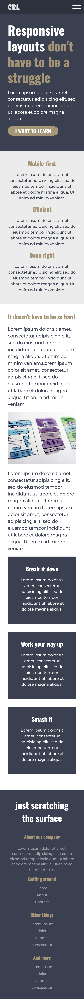
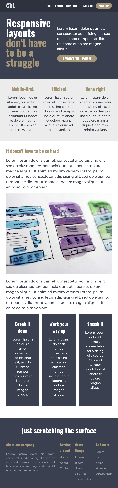
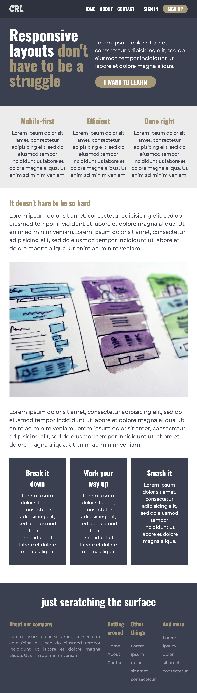

# Conquering Responsive Layouts final challenge
My solution to the final challenge from Kevin Powell's Conquering Responsive Layouts course [Conquering Responsive Layouts](https://courses.kevinpowell.co/conquering-responsive-layouts). Done mostly with HTML and CSS, and a tiny bit of JS for the mobile menu functionality.

### Screenshots

